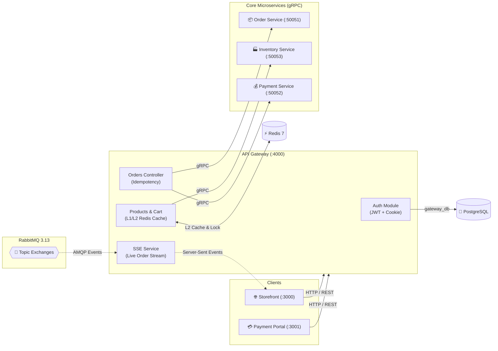

<div align="center">

# 🛡️ Hermex API Gateway
### Central Ingress, Multi-Layer Cache & Edge Security

[ **English** ] &nbsp;•&nbsp; [ [Українська](README.ua.md) ] &nbsp;•&nbsp; [ [System Overview](../overview/README.md) ]

<p align="center">
  HTTP Ingress (:4000) &bull; Swagger UI (/docs) &bull; L1/L2 Redis Cache &bull; SSE Order Stream
</p>

</div>

> **API Gateway** is the central ingress and edge reverse proxy for the Hermex microservices ecosystem.  
> It manages client authentication and authorization, routes internal gRPC calls, handles multi-layer catalog caching (L1/L2), mitigates thundering herds via singleflight promise coalescing, provides Server-Sent Events (SSE) live order tracking, and guarantees distributed correlation tracing (`x-correlation-id`).

---

## 🏛️ Architecture & Edge Routing



---

## 🚀 Key Features

### 1. Authentication & Security (AuthModule)
- **JWT Access Token + HttpOnly Refresh Cookie:** XSS-resistant token delivery.
- **Stateless Revocation (`token_version`):** Immediate invalidation on logout or password rotation by incrementing `token_version` in `UserEntity` without external session stores.
- **OWASP Anti-Enumeration (CWE-204):** Uniform `Invalid email or password` responses.
- **Anti-Timing Attack Protection:** Constant-time `bcrypt.compare` against `DUMMY_HASH` when emails are not found in the database.
- **Error Masking (CWE-209):** Internal SQL errors and RPC traces concealed behind a generic `500 Internal server error` in production.

### 2. Multi-Layer Catalog Caching (L1/L2 & Singleflight)
- **L1 HTTP Edge Cache:** `Cache-Control: public, max-age=60, stale-while-revalidate=300`.
- **L2 Redis 7 Cache:** Fast-path key `hermex:catalog:page:1:default` (TTL 60s) reducing latency to ~1 ms.
- **Cache Stampede Guard (Singleflight):** Promise coalescing guarantees that only 1 concurrent query hits downstream services upon cache expiry.
- **Graceful Fallback:** Automatic degradation to live gRPC queries if Redis is unavailable.

### 3. Cart Batch Validation (`POST /api/v1/cart/validate`)
- Real-time verification of warehouse inventory and pricing in a single non-blocking gRPC call to `inventory-service`.

### 4. Real-Time Order Gateway (Live SSE)
- `GET /api/v1/orders/:id/live`: Streams order status changes directly from RabbitMQ topic exchanges.
- Auto-deleting exclusive queues prevent channel churn and broker resource leaks.

---

## 📡 REST API & Endpoints

Interactive Swagger OpenAPI 3.0 documentation:  
👉 **[http://localhost:4000/docs](http://localhost:4000/docs)**

| Method | Route | Description | Auth |
| :--- | :--- | :--- | :---: |
| `POST` | `/api/v1/auth/register` | Register new customer | Public |
| `POST` | `/api/v1/auth/login` | Login and issue tokens | Public |
| `POST` | `/api/v1/auth/refresh` | Rotate Access Token via Cookie | Cookie |
| `POST` | `/api/v1/auth/logout` | Revoke session | Bearer JWT |
| `GET` | `/api/v1/products` | Catalog listing with filters & pagination | Public (L1/L2) |
| `GET` | `/api/v1/products/:id` | Product detail by UUID | Public |
| `POST` | `/api/v1/cart/validate` | Batch stock and price verification | Public |
| `POST` | `/api/v1/orders` | Create order (Saga initiation) | Bearer JWT |
| `GET` | `/api/v1/orders/:id` | Get order details | Public (UUID) |
| `GET` | `/api/v1/orders/:id/live`| Live SSE stream of order updates | Public (UUID) |
| `POST` | `/api/v1/payments/process` | Capture order payment | Public / Key |
| `GET` | `/health` | Liveness & readiness probes | Public |
| `GET` | `/metrics` | Prometheus metrics endpoint | Internal |

---

## ⚙️ Environment Variables (`.env`)

| Variable | Type | Default | Description |
| :--- | :---: | :---: | :--- |
| `PORT` | number | `4000` | HTTP listening port |
| `NODE_ENV` | string | `development` | Environment mode (`development` / `production`) |
| `DB_HOST` | string | `localhost` | PostgreSQL hostname |
| `DB_PORT` | number | `5432` | PostgreSQL port |
| `DB_USERNAME` | string | `hermex` | Database username |
| `DB_PASSWORD` | string | `hermex_secret_pwd`| Database password |
| `DB_DATABASE` | string | `gateway_db` | Gateway database name |
| `REDIS_HOST` | string | `localhost` | Redis 7 hostname |
| `REDIS_PORT` | number | `6379` | Redis 7 port |
| `RABBITMQ_URL` | string | `amqp://...` | AMQP connection string |
| `JWT_ACCESS_SECRET` | string | *Required* | JWT Access token signing key |
| `JWT_REFRESH_SECRET` | string | *Required* | JWT Refresh token signing key |
| `ORDER_SERVICE_GRPC_URL` | string | `localhost:50051`| Order Service gRPC address |
| `PAYMENT_SERVICE_GRPC_URL`| string | `localhost:50052`| Payment Service gRPC address |
| `INVENTORY_SERVICE_GRPC_URL`| string | `localhost:50053`| Inventory Service gRPC address |

---

## 🛠️ Local Development & Docker

```bash
# Install dependencies
bun install

# Start development server (watch mode)
bun run start:dev

# Launch containerized service
docker compose up -d --build
```
