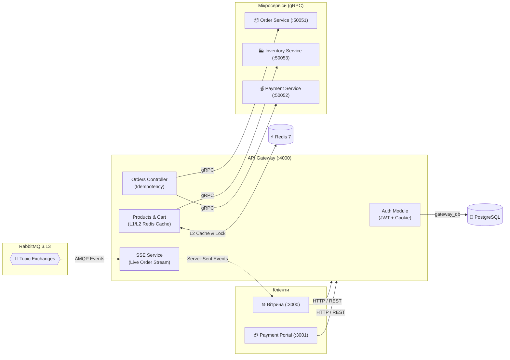

<div align="center">

# 🛡️ Hermex API Gateway
### Вхідний шлюз, багаторівневий кеш та безпека периметра

[ [English](README.md) ] &nbsp;•&nbsp; [ **Українська** ] &nbsp;•&nbsp; [ [Головний огляд](../overview/README.ua.md) ]

<p align="center">
  Вхідний HTTP-порт (:4000) &bull; Документація Swagger (/docs) &bull; L1/L2 кешування &bull; SSE потік статусів
</p>

</div>

> **API Gateway** — центральна точка входу (Ingress & Reverse Proxy) в мікросервісну екосистему Hermex.  
> Відповідає за аутентифікацію клієнтів, маршрутизацію gRPC-запитів до внутрішніх сервісів, багаторівневе кешування каталогу (L1/L2), захист від лавинних запитів (Singleflight), стрімінг статусів замовлень (SSE) та наскрізне трасування (`x-correlation-id`).

---

## 🏛️ Архітектура та маршрутизація



---

## 🚀 Ключові можливості

### 1. Безпека та аутентифікація (AuthModule)
- **JWT Access Token + HttpOnly Refresh Token Cookie:** Захищене зберігання токенів без ризику XSS-атак.
- **Stateless Revocation (`token_version`):** Миттєве анулювання сесій користувача при виході чи зміні пароля через інкремент `token_version` у `UserEntity`.
- **OWASP Anti-Enumeration (CWE-204):** Знеособлені відповіді при спробі входу (`Invalid email or password`).
- **Anti-Timing Attack:** Криптографічне порівняння за постійний час через `DUMMY_HASH`, якщо email відсутній у базі.
- **Маскування помилок (CWE-209):** Приховування системних деталей у продакшені (`500 Internal server error`).

### 2. Багаторівневе кешування каталогу (L1 / L2 Fast-Path & Singleflight)
- **L1 Edge Cache:** HTTP-заголовки `Cache-Control: public, max-age=60, stale-while-revalidate=300`.
- **L2 Redis 7 Cache:** Швидкий ключ `hermex:catalog:page:1:default` (TTL 60 с), що забезпечує відповідь за ~1 мс.
- **Захист від Cache Stampede (Singleflight):** Механізм об'єднання запитів — при закінченні TTL лише 1 запит звертається до бекенду, решта отримує спільний результат.
- **Graceful Fallback:** Безперебійна робота через прямі gRPC-запити при перезапуску Redis.

### 3. Батч-валідація кошика (`POST /api/v1/cart/validate`)
- Миттєва перевірка актуальності цін та залишків за один gRPC-виклик до `inventory-service`.

### 4. Real-time Event Gateway (Live SSE)
- `GET /api/v1/orders/:id/live`: Потокове передавання змін статусів замовлень клієнту без поллінгу.
- Ексклюзивні авто-видаляльні черги усувають навантаження на брокер.

---

## 📡 REST API та ендпоінти

Інтерактивна документація Swagger OpenAPI:  
👉 **[http://localhost:4000/docs](http://localhost:4000/docs)**

| Метод | Шлях | Опис | Аутентифікація |
| :--- | :--- | :--- | :---: |
| `POST` | `/api/v1/auth/register` | Реєстрація нового користувача | Публічний |
| `POST` | `/api/v1/auth/login` | Вхід у систему | Публічний |
| `POST` | `/api/v1/auth/refresh` | Ротація Access токена по Cookie | Cookie |
| `POST` | `/api/v1/auth/logout` | Відкликання поточної сесії | Bearer JWT |
| `GET` | `/api/v1/products` | Каталог товарів з фільтрами | Публічний (L1/L2) |
| `GET` | `/api/v1/products/:id` | Детальна інформація про товар | Публічний |
| `POST` | `/api/v1/cart/validate` | Батч-валідація позицій кошика | Публічний |
| `POST` | `/api/v1/orders` | Створення замовлення (старт Saga) | Bearer JWT |
| `GET` | `/api/v1/orders/:id` | Отримання даних замовлення | Публічний (UUID) |
| `GET` | `/api/v1/orders/:id/live`| Потоковий SSE-стрім статусів | Публічний (UUID) |
| `POST` | `/api/v1/payments/process` | Проведення оплати замовлення | Публічний / Key |
| `GET` | `/health` | Перевірка працездатності сервісу | Публічний |
| `GET` | `/metrics` | Ендпоінт метрик Prometheus | Внутрішній |

---

## ⚙️ Змінні оточення (`.env`)

| Змінна | Тип | За замовчуванням | Опис |
| :--- | :---: | :---: | :--- |
| `PORT` | number | `4000` | HTTP-порт сервісу |
| `NODE_ENV` | string | `development` | Режим оточення (`development` / `production`) |
| `DB_HOST` | string | `localhost` | Хост PostgreSQL |
| `DB_PORT` | number | `5432` | Порт PostgreSQL |
| `DB_USERNAME` | string | `hermex` | Користувач бази даних |
| `DB_PASSWORD` | string | `hermex_secret_pwd`| Пароль бази даних |
| `DB_DATABASE` | string | `gateway_db` | Назва бази даних |
| `REDIS_HOST` | string | `localhost` | Хост Redis 7 |
| `REDIS_PORT` | number | `6379` | Порт Redis 7 |
| `RABBITMQ_URL` | string | `amqp://...` | AMQP рядок підключення |
| `JWT_ACCESS_SECRET` | string | *Обов'язковий* | Ключ підпису Access токенів |
| `JWT_REFRESH_SECRET` | string | *Обов'язковий* | Ключ підпису Refresh токенів |
| `ORDER_SERVICE_GRPC_URL` | string | `localhost:50051`| Адреса Order Service gRPC |
| `PAYMENT_SERVICE_GRPC_URL`| string | `localhost:50052`| Адреса Payment Service gRPC |
| `INVENTORY_SERVICE_GRPC_URL`| string | `localhost:50053`| Адреса Inventory Service gRPC |

---

## 🛠️ Локальна розробка та Docker

```bash
# Встановлення залежностей
bun install

# Запуск у режимі розробки
bun run start:dev

# Запуск у Docker Compose
docker compose up -d --build
```
